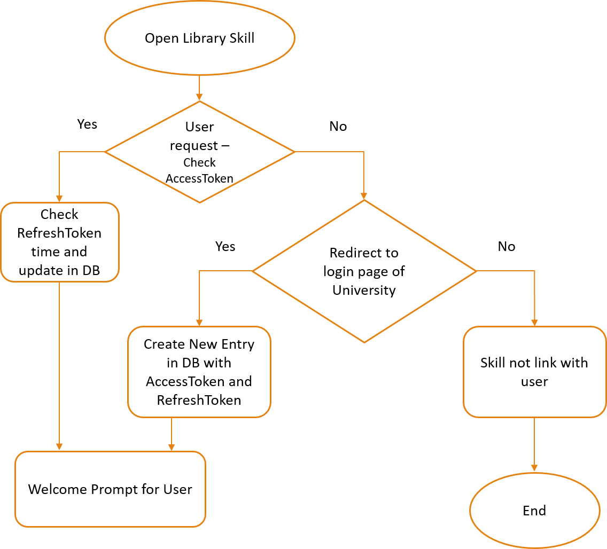
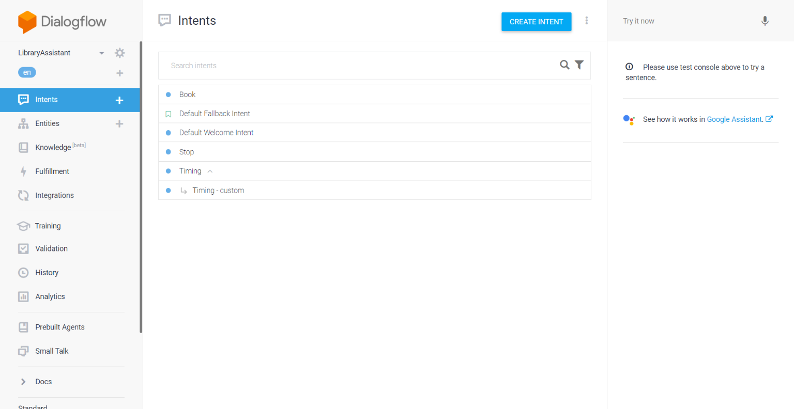

# Library-Google-Assistant
Library Google Assistant demo app

## Why library voice assistant?

- Voice control from any Google assistant compatible devices
- Advanced technology for easy remote access
- Attractive and optimized solution
- Save time and energy
- Convenient for differently abled people

## How library voice assistant helps?

- Easy to find location/ timing of library 
- Locate books within seconds 
- Search a book by Author, Title, Publisher, Discipline, Language, etc
- Check total number of books issued on your account 
- Conveniently renew books
- Access all functionalities on the website with voice commands
- Infinite possibilities

## Flow chart

## Implementation	

- Implement OAuth2.0 Server to store Users details, authorization code, access token and expired datetime. (OAuth2.0 is necessary to use with google assistant)
- On Server-side node.js and database as Sqlite3
- Tables as: users, oauth_authorize, oauth_client, oauth_referesh_token, oauth_token
- More info on OAuth2.0: https://oauth.net/2/
- Deploy/install my Node server on western server. (Requirement: Linux system)

## Requirement from Library

- Provide APIs as below:
  - Authenticate User with western credentials
  - Details of all library name, timing and location
  - Search book with title, author, same as on website

## Dialogflow App

## Demo

[Link](./Library%20Assistant%20-%20Vatsal%20Shah%20-%20Video.mp4)

## Presentation

[Link](Library%20Assistant%20-%20Vatsal%20Shah.pptx)